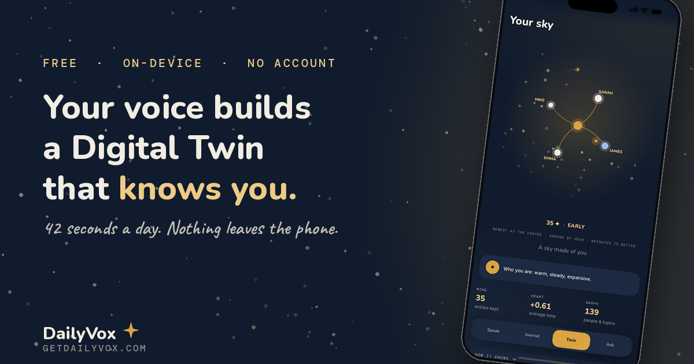
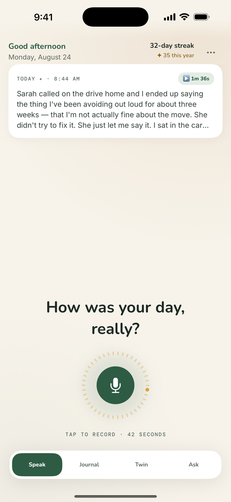
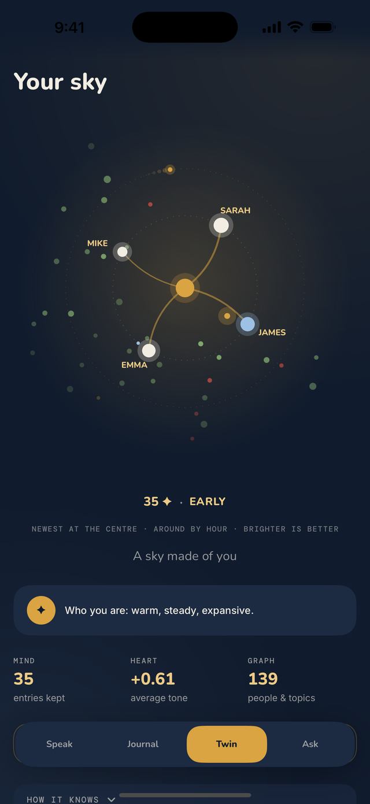
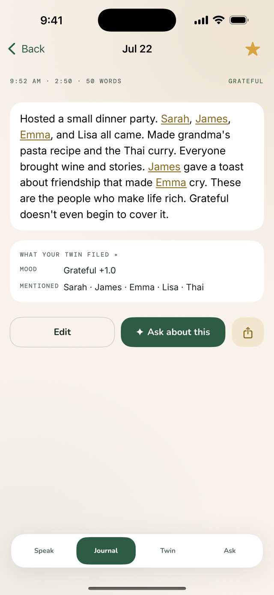
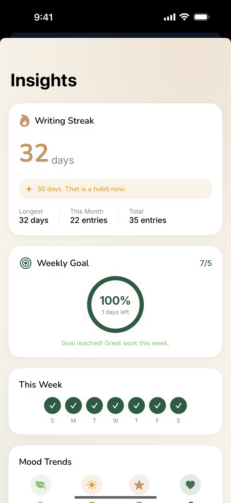
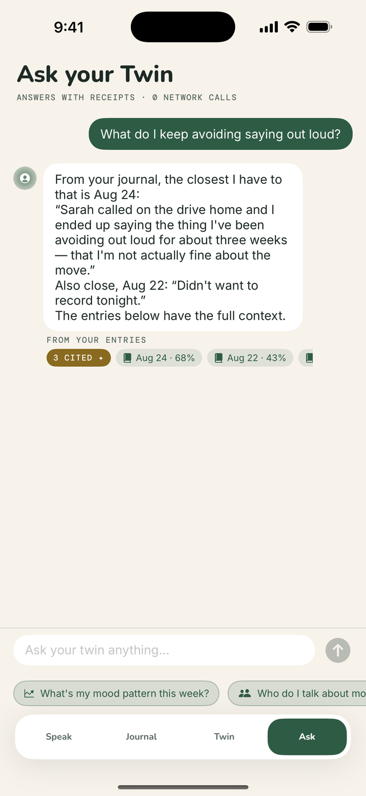
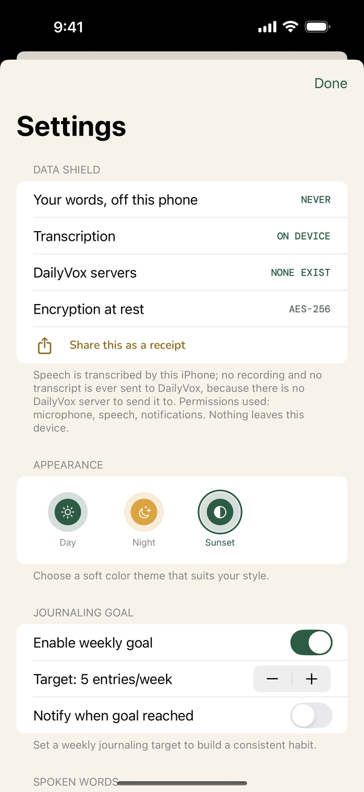

  

<h1 align="center">DailyVox</h1>

<strong>Speak for 42 seconds. Watch your words become stars.</strong>

The free voice journal with on-device AI and a Digital Twin that learns who you are — entirely on your phone. iPhone today; Android in development.

<b>Free forever</b> &nbsp;·&nbsp; 100% on-device &nbsp;·&nbsp; ⭐️ 5-star rated &nbsp;·&nbsp; 500+ downloads, growing ~50% week-over-week &nbsp;·&nbsp; 🚀 live on Product Hunt

  
  
  

  
  &nbsp;
  

  
  
  
  
  

  
  
  
  
  
  
  

  
  
  
  
  
  

---

## What is DailyVox?

DailyVox turns your spoken thoughts into a **constellation of stars**. Every journal entry becomes a point of light in your inner sky — mood-colored, connected by patterns only you can see.

Behind the scenes, an **on-device Digital Twin** learns how you think, how you feel, and who matters to you. It predicts your mood, answers questions about your patterns, and reveals meaning across months of entries. No accounts. No servers. No data collection.

**Your thoughts never leave your device. Ever.**

  

---

## App Screenshots

  
  
  
  
  
  

Real screenshots from v1.11.0, seeded with a demo journal. Regenerate with <code>ios/AppStore/screenshot-src/make_screenshots.sh</code>.

---

## Why DailyVox?

| | DailyVox | Most Journal Apps |
|:--|:--|:--|
| **Price** | Free forever | $35-50/year |
| **AI processing** | 100% on-device | Cloud servers |
| **Account required** | No | Yes |
| **Data collection** | Zero | Analytics, text, usage |
| **Works offline** | Fully | Partial or none |
| **Digital Twin** | Yes | No |
| **Voice-first** | Yes (offline) | Text-first or cloud |

---

## Core Features

### Constellation Journal
Every entry becomes a mood-colored star. Gold for positive, sage for calm, blue for reflective, coral for stressed. Over time, your constellation reveals patterns — clusters around topics, connections between feelings, an inner sky that's uniquely yours.

### Digital Twin AI
Four on-device AI models build a private mirror of your personality:
- **Mind** — communication style, vocabulary, reasoning
- **Heart** — emotional signature, sentiment arc, mood triggers
- **Voice** — speech patterns, pacing, tone
- **Graph** — people, places, topics, and how they connect

Ask your Twin questions. It answers from your history, running entirely on your iPhone's Neural Engine.

### 42-Second Voice Entries
Speak at 150 words/minute instead of typing at 40. No blank page anxiety. DailyVox transcribes on-device using Apple Speech — no internet required.

### Mood Tracking & Predictions
Automatic sentiment analysis on every entry. Trends across days, weeks, and months. Your Twin predicts tomorrow's mood based on your patterns.

### Privacy by Architecture
Zero network calls. Zero third-party SDKs. Zero analytics. Apple's strictest privacy label: **"Data Not Collected."** Your journal is encrypted on-device. Optional iCloud sync uses your personal account with Apple's end-to-end encryption.

### Everything Else
- **Biometric lock** — Face ID / Touch ID
- **Photo attachments** — up to 5 per entry, stored locally
- **Encrypted exports** — PDF, JSON, Markdown, CSV, AES-256 backup
- **Widgets** — Home Screen & Lock Screen for streaks and quick recording
- **Siri Shortcuts** — "Hey Siri, open my journal"
- **Journaling goals** — weekly targets with milestone celebrations
- **4 themes** — System, Ivory, Light, Dark

---

## Tech Stack

| Layer | Technology |
|:--|:--|
### iPhone — shipping

| Layer | Technology |
|:--|:--|
| **Language** | Swift, SwiftUI |
| **Data** | Core Data + CloudKit (optional iCloud sync) |
| **AI/NLP** | Apple NaturalLanguage (NLTagger, NLEmbedding) |
| **Speech** | Apple Speech (SFSpeechRecognizer, on-device) |
| **ML** | Neural Engine via CoreML |
| **Minimum** | iOS 17.0+ |
| **Devices** | iPhone, iPad (Universal) |

### Android — in development, not released

| Layer | Technology |
|:--|:--|
| **Language** | Kotlin, Jetpack Compose |
| **Data** | Room (no cloud sync; Auto Backup deliberately disabled) |
| **Sentiment** | Bundled VADER lexicon, 7,517 entries — Android has no system sentiment API |
| **Entities** | Model-free capitalisation heuristic — Android has no system NER, and the strong open models restrict commercial use |
| **Speech** | `createOnDeviceSpeechRecognizer` (API 33+), which fails rather than falling back to a network |
| **Prosody** | MediaCodec + autocorrelation pitch/energy in plain Kotlin |
| **Body** | Health Connect — opt-in, read-only, four record types |
| **Minimum** | API 29 · targetSdk 36 |
| **Permissions** | RECORD_AUDIO, POST_NOTIFICATIONS, VIBRATE, USE_BIOMETRIC. **No INTERNET permission of any kind.** |

Both platforms are measured against each other rather than assumed equivalent: a
cross-language conformance harness runs the same frozen fixtures through the
Swift and Kotlin graph implementations, and the two substitutions above were
scored against the Apple frameworks they replace on the same real diary text.

---

## What's New — v1.11.0 (August 2026)

**Live transcription.** The recording screen and the Dynamic Island show what you are saying as you say it, with a gold star when a name is caught. On-device, always. The Island carries the 42-second ring, the phrase being heard, and Finish or Discard without opening the app. A "Speak" control can go in Control Centre, on the Lock Screen, or on the Action Button.

**The correction that mattered more than any feature.** Until this release the transcriber preferred on-device recognition only when the phone was offline — which meant that on a connected iPhone, nearly every user nearly always, the recording went to Apple's speech servers for better punctuation. Every claim this project makes rested on that not happening. On-device recognition is now unconditional: where no on-device model is installed, transcription stops and says why rather than reaching for the network. Voice search had the same fault and the same fix.

**The constellation encodes the journal.** Distance from the centre is how long ago an entry was spoken; the angle is the hour of day; size is how long you spoke. A usual bedtime becomes a visible band. Positions used to be hashes.

**Two new share cards.** "Tonight" is different every night by construction. "Body" reads how you slept against how you wrote — absent unless you have kept body signals, its own switch off every time the sheet opens, and heart rate never on any shareable image.

**And a long list of things that were simply broken:** the starred filter could not be reached at all; the home screen and Insights could disagree about your streak; editing an entry rewrote its timestamp and an edit could be lost if iOS reclaimed the app; a phone call cost you the recording in progress; the microphone now sits at the bottom of the Speak tab, where your thumb is.

[Full changelog](CHANGELOG.md) · [Release history on the site](https://getdailyvox.com/roadmap) · [Try the interactive demo](https://getdailyvox.com/demo)

---

## Roadmap

> **Platforms.** DailyVox is live on the App Store for iPhone and iPad. The
> Android app is **in development and not released** — there is no Play Store
> listing and no announced date. The single largest untested assumption is
> whether Android's speech recogniser capitalises names, which the entity graph
> depends on. See [`ROADMAP.md`](ROADMAP.md) for the parity matrix.

| Version | Focus | Status |
|:--|:--|:--|
| v1.0 | Core voice journal + Digital Twin | Shipped |
| v1.1 | Twin Predictions + Shareable Cards | Shipped |
| v1.2 | Ask Your Twin (chat) | Shipped |
| v1.3 | Constellation Update | Shipped |
| v1.3.5 | Dynamic Island + New Icon | Shipped |
| v1.4.0 | Warm redesign — Digital Twin moved to center | Shipped |
| v1.4.1 | Voice-first "Speak your first star" onboarding | **Shipped** |
| v1.5 | Body Twin — HealthKit snapshots, body whisper, review queue | Shipped |
| v1.5.5 | Ambient Signals — on-device photo + music context | Shipped (in v1.6.0) |
| v1.6 | Semantic Memory & Measurable Fidelity | **Shipped** |
| v1.7 | Foundation Models Twin — grounded on-device chat with citations | **Built · next release** |
| v1.8 | Multi-Language (Tamil, Kannada, Hindi, Spanish, Japanese, German first) | Planned |
| v2.0 | Apple Intelligence Native (Siri AI, iOS 27) | Planned |

Beyond v2.0: Personality Depth, Agentic Twin, Ambient Twin, the open Twin Protocol, and the DailyVox Mirror device. iPhone-only by conviction — the phone is the Twin's body, and every feature works end-to-end on the phone alone (no Mac or second computer, ever); portability lives in the data (Twin Protocol), not in platform ports — [full roadmap](ROADMAP.md)

---

## FAQ

<strong>Is DailyVox really free?</strong>

Yes. No subscriptions, no in-app purchases, no ads. MIT licensed. Free forever.

<strong>Does it work without internet?</strong>

Yes. Every feature — voice transcription, AI analysis, Digital Twin — works fully offline.

<strong>Where is my data stored?</strong>

On your device in an encrypted Core Data store. Optional iCloud sync goes through your personal iCloud account (end-to-end encrypted by Apple). DailyVox never has access.

<strong>What is the Digital Twin?</strong>

An on-device AI model that learns your personality, communication style, emotional patterns, and life themes from your journal entries. It runs entirely on your iPhone's Neural Engine. You can chat with it, ask about your patterns, and get mood predictions.

<strong>Does DailyVox collect analytics or telemetry?</strong>

No. Zero data collection of any kind. No analytics SDKs, no crash reporting services, no telemetry. Verified by Apple's privacy label.

<strong>Can I export my journal?</strong>

Yes. PDF, JSON, Markdown, CSV, or AES-256 encrypted backup.

---

## Why I Built This

I've written a diary every day for 20 years. The problem was always the same — by the time I sat down to type, half the details were gone. Voice changes that. You speak at 150 words a minute without filtering yourself.

But every voice diary app I tried wanted to upload my recordings to their servers. That was a deal-breaker. So I built DailyVox — a voice journal where everything runs on-device, and the AI that knows you best is the one that never shares you with anyone.

The constellation metaphor came from staring at my own journal entries — hundreds of days, each one a tiny light. Together they form patterns. DailyVox makes those patterns visible.

— [Karthikeyan NG](https://github.com/intrepidkarthi)

---

## The research behind it

A model built to be private cannot be watched in production. With no egress there is no dashboard, no population A/B test, no confusion matrix — and its single user is the only witness. So it has to be evaluated on the device, before it ships.

That is the argument of **[Measuring a Model of One](https://getdailyvox.com/paper/measuring-a-model-of-one.pdf)**, and of TwinEval, the evaluation harness it releases. Every metric is lift over an explicit baseline; a permutation null and five negative controls collapse to chance when the link between label and text is destroyed, which is what lets the numbers say *no*.

What the instrument found, leading with the losses:

| Finding | Result |
|:--|:--|
| The deployed Twin on the author's own diary | **lift −25.2%** — below a do-nothing baseline |
| OS valence across 1,473 self-labelled entries | **r = +0.59** — real signal |
| The keyword emotion layer | **43.5%** against an **85.0%** majority baseline |
| A 105 KB openness head, 1,307 writers | **r = +0.13** — statistically real, practically worthless |

Three of those four are the product losing. An instrument that cannot catch its own maker's model is not an instrument.

**Five problems are open**, and none of them need access to anyone's diary — a licence-clean emotion head that survives the deployment gate, a long-horizon memory benchmark, code-mixed on-device NLP, aggregating evidence without a coordinating server, and a consented cohort. Each is written up with what a good contribution would look like on the [research page](https://getdailyvox.com/research). If any of it is close to what you work on, I would rather do it with you than alone.

---

## Contributing & Support

DailyVox is open source (MIT) and built solo, in the open. If the mission — a personal AI that's **private by construction** — resonates, here's how to help:

- ⭐ **Star this repo** — the simplest way to help others find it
- 🚀 **[Upvote on Product Hunt](https://www.producthunt.com/products/dailyvox)** — we just launched
- 🛠️ **Contribute** — issues and PRs welcome. Start with [CONTRIBUTING.md](CONTRIBUTING.md) and [ARCHITECTURE.md](ARCHITECTURE.md)
- 🗣️ **Try it and tell me what's missing** — [download free](https://apps.apple.com/app/id6760454642) or [explore the interactive demo](https://getdailyvox.com/demo)

It's a genuinely fun codebase to hack on: 100% on-device AI, SwiftUI, a Canvas-rendered constellation, and a Digital Twin engine — no backend to spin up, no API keys, just clone and run.

---

## Links

| | |
|:--|:--|
| **App Store** | [Download DailyVox Free](https://apps.apple.com/app/id6760454642) |
| **Website** | [getdailyvox.com](https://getdailyvox.com) |
| **Blog** | [getdailyvox.com/blog](https://getdailyvox.com/blog) |
| **Privacy Policy** | [getdailyvox.com/privacy](https://getdailyvox.com/privacy.html) |
| **Roadmap** | [getdailyvox.com/roadmap](https://getdailyvox.com/roadmap) — what shipped, what is parked, and why |
| **Research** | [getdailyvox.com/research](https://getdailyvox.com/research) — the programme, and five open problems |
| **Paper** | [Measuring a Model of One](https://getdailyvox.com/paper/measuring-a-model-of-one.pdf) (PDF, preprint) |
| **Press Kit** | [getdailyvox.com/press](https://getdailyvox.com/press) |
| **Contact** | intrepidkarthi@gmail.com |

---

  <em>DailyVox is and will always be free. No subscriptions, no in-app purchases, no ads.</em> 
  <a href="https://apps.apple.com/app/id6760454642"><strong>Download it today.</strong></a>

