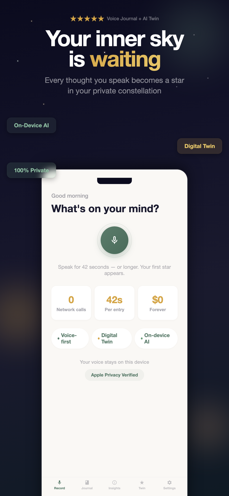
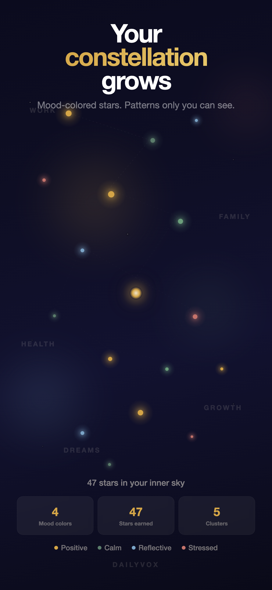
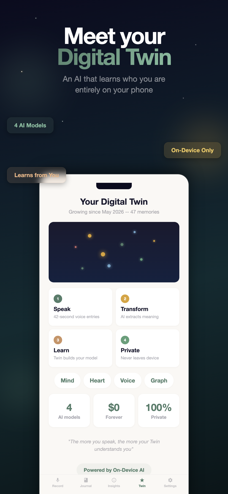
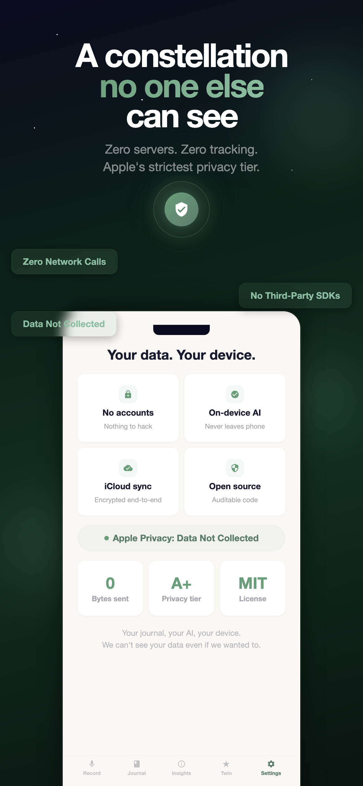
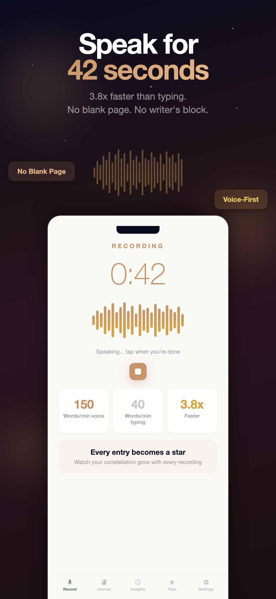
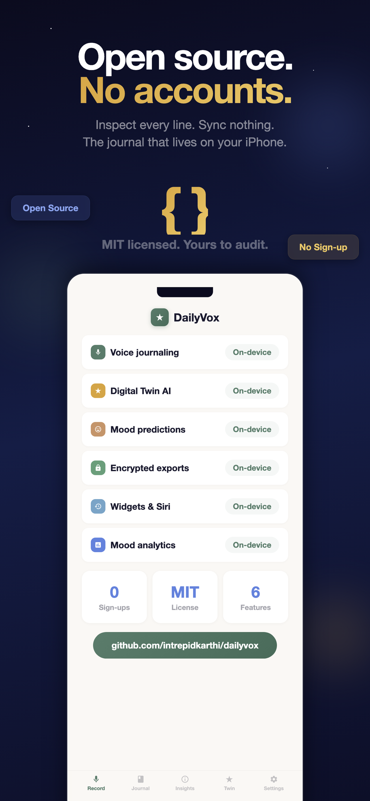

  
  
  

<h1 align="center">DailyVox</h1>

<strong>Speak for 42 seconds. Watch your words become stars.</strong>

The free voice journal with on-device AI and a Digital Twin that learns who you are — entirely on your iPhone.

  
  
  

  
  
  
  
  

---

## What is DailyVox?

DailyVox turns your spoken thoughts into a **constellation of stars**. Every journal entry becomes a point of light in your inner sky — mood-colored, connected by patterns only you can see.

Behind the scenes, an **on-device Digital Twin** learns how you think, how you feel, and who matters to you. It predicts your mood, answers questions about your patterns, and reveals meaning across months of entries. No accounts. No servers. No data collection.

**Your thoughts never leave your device. Ever.**

  

---

## App Screenshots

  
  
  
  
  
  

---

## Why DailyVox?

| | DailyVox | Most Journal Apps |
|:--|:--|:--|
| **Price** | Free forever | $35-50/year |
| **AI processing** | 100% on-device | Cloud servers |
| **Account required** | No | Yes |
| **Data collection** | Zero | Analytics, text, usage |
| **Works offline** | Fully | Partial or none |
| **Digital Twin** | Yes | No |
| **Voice-first** | Yes (offline) | Text-first or cloud |

---

## Core Features

### Constellation Journal
Every entry becomes a mood-colored star. Gold for positive, sage for calm, blue for reflective, coral for stressed. Over time, your constellation reveals patterns — clusters around topics, connections between feelings, an inner sky that's uniquely yours.

### Digital Twin AI
Four on-device AI models build a private mirror of your personality:
- **Mind** — communication style, vocabulary, reasoning
- **Heart** — emotional signature, sentiment arc, mood triggers
- **Voice** — speech patterns, pacing, tone
- **Graph** — people, places, topics, and how they connect

Ask your Twin questions. It answers from your history, running entirely on your iPhone's Neural Engine.

### 42-Second Voice Entries
Speak at 150 words/minute instead of typing at 40. No blank page anxiety. DailyVox transcribes on-device using Apple Speech — no internet required.

### Mood Tracking & Predictions
Automatic sentiment analysis on every entry. Trends across days, weeks, and months. Your Twin predicts tomorrow's mood based on your patterns.

### Privacy by Architecture
Zero network calls. Zero third-party SDKs. Zero analytics. Apple's strictest privacy label: **"Data Not Collected."** Your journal is encrypted on-device. Optional iCloud sync uses your personal account with Apple's end-to-end encryption.

### Everything Else
- **Biometric lock** — Face ID / Touch ID
- **Photo attachments** — up to 5 per entry, stored locally
- **Encrypted exports** — PDF, JSON, Markdown, CSV, AES-256 backup
- **Widgets** — Home Screen & Lock Screen for streaks and quick recording
- **Siri Shortcuts** — "Hey Siri, open my journal"
- **Journaling goals** — weekly targets with milestone celebrations
- **4 themes** — System, Ivory, Light, Dark

---

## Tech Stack

| Layer | Technology |
|:--|:--|
| **Language** | Swift, SwiftUI |
| **Data** | Core Data + CloudKit (optional iCloud sync) |
| **AI/NLP** | Apple NaturalLanguage (NLTagger, NLEmbedding) |
| **Speech** | Apple Speech (SFSpeechRecognizer, on-device) |
| **ML** | Neural Engine via CoreML |
| **Minimum** | iOS 17.0+ |
| **Devices** | iPhone, iPad (Universal) |

---

## What's New: v1.3.5 — Dynamic Island & New Icon

- **Dynamic Island recording timer** — live elapsed time and waveform while you record, counting up past 42 seconds so you can speak as long as you need
- **"A new star appeared" Live Activity** — a brief celebratory pop the moment your entry is saved
- **Streak in the Dynamic Island** (opt-in) — pin `★ Day N` to the Dynamic Island and Lock Screen
- **Constellation Lock Screen widget** — Canvas-rendered mini constellation, one star per recent entry, coloured by mood
- **iOS 18 icon variants** — proper dark-mode (golden mic on warm charcoal) and tinted (monochrome silhouette)
- Built on top of v1.3.0's Constellation Update (Canvas visualisation, Ivory theme, celestial onboarding)

[Full changelog](CHANGELOG.md) | [Read the constellation story](https://getdailyvox.com/blog/constellation-update)

---

## Roadmap

| Version | Focus | Status |
|:--|:--|:--|
| v1.0 | Core voice journal + Digital Twin | Shipped |
| v1.1 | Twin Predictions + Shareable Cards | Shipped |
| v1.2 | Ask Your Twin (chat) | Shipped |
| v1.3 | Constellation Update | Shipped |
| v1.3.5 | Dynamic Island + New Icon | **Current** |
| v1.4 | Semantic Search + Proactive Insights | Planned |
| v1.5 | Apple Watch + macOS | Planned |
| v2.0 | Apple Foundation Models (on-device LLM) + Android | Planned |

[Full roadmap](ROADMAP.md)

---

## FAQ

<strong>Is DailyVox really free?</strong>

Yes. No subscriptions, no in-app purchases, no ads. MIT licensed. Free forever.

<strong>Does it work without internet?</strong>

Yes. Every feature — voice transcription, AI analysis, Digital Twin — works fully offline.

<strong>Where is my data stored?</strong>

On your device in an encrypted Core Data store. Optional iCloud sync goes through your personal iCloud account (end-to-end encrypted by Apple). DailyVox never has access.

<strong>What is the Digital Twin?</strong>

An on-device AI model that learns your personality, communication style, emotional patterns, and life themes from your journal entries. It runs entirely on your iPhone's Neural Engine. You can chat with it, ask about your patterns, and get mood predictions.

<strong>Does DailyVox collect analytics or telemetry?</strong>

No. Zero data collection of any kind. No analytics SDKs, no crash reporting services, no telemetry. Verified by Apple's privacy label.

<strong>Can I export my journal?</strong>

Yes. PDF, JSON, Markdown, CSV, or AES-256 encrypted backup.

---

## Why I Built This

I've written a diary every day for 20 years. The problem was always the same — by the time I sat down to type, half the details were gone. Voice changes that. You speak at 150 words a minute without filtering yourself.

But every voice diary app I tried wanted to upload my recordings to their servers. That was a deal-breaker. So I built DailyVox — a voice journal where everything runs on-device, and the AI that knows you best is the one that never shares you with anyone.

The constellation metaphor came from staring at my own journal entries — hundreds of days, each one a tiny light. Together they form patterns. DailyVox makes those patterns visible.

— [Karthikeyan NG](https://github.com/intrepidkarthi)

---

## Links

| | |
|:--|:--|
| **App Store** | [Download DailyVox Free](https://apps.apple.com/app/id6760454642) |
| **Website** | [getdailyvox.com](https://getdailyvox.com) |
| **Blog** | [getdailyvox.com/blog](https://getdailyvox.com/blog) |
| **DailyVoxTwin Engine** | [github.com/intrepidkarthi/DailyVoxTwin](https://github.com/intrepidkarthi/DailyVoxTwin) |
| **Privacy Policy** | [getdailyvox.com/privacy](https://getdailyvox.com/privacy.html) |
| **Press Kit** | [getdailyvox.com/press](https://getdailyvox.com/press) |
| **Contact** | intrepidkarthi@gmail.com |

---

  <em>DailyVox is and will always be free. No subscriptions, no in-app purchases, no ads.</em> 
  <a href="https://apps.apple.com/app/id6760454642"><strong>Download it today.</strong></a>

