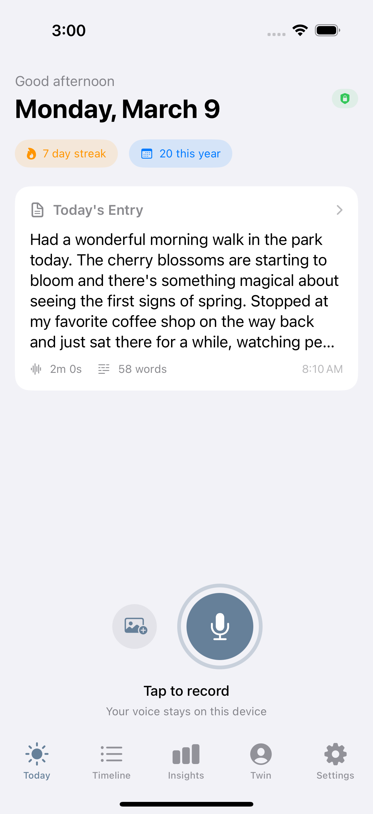
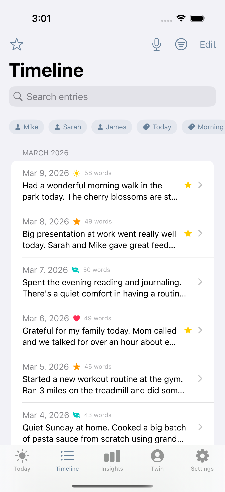
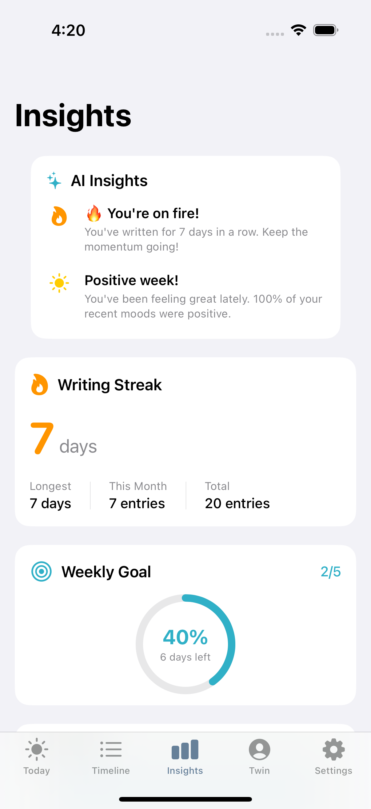
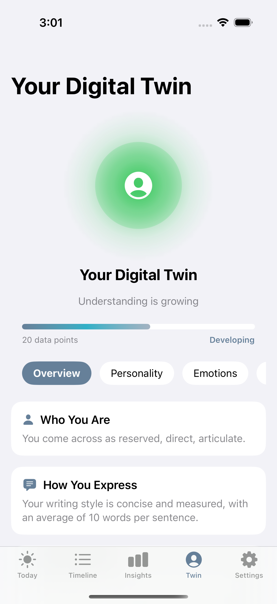
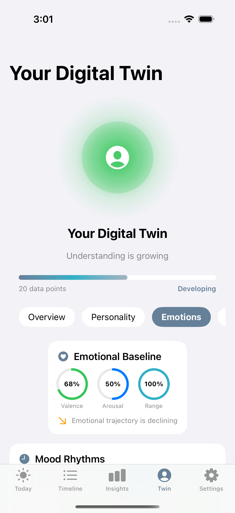
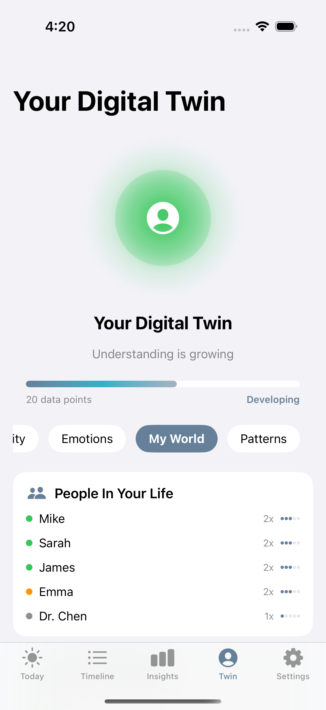
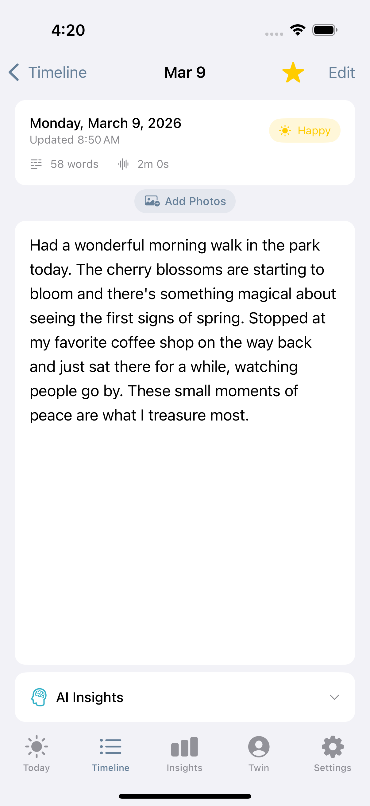
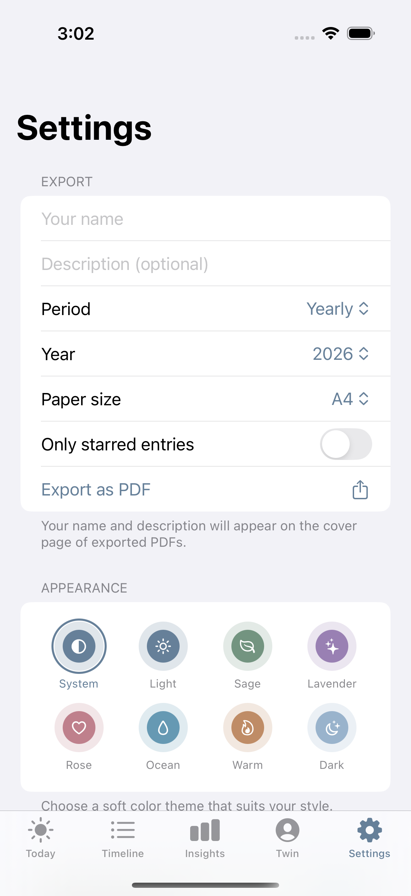

# DailyVox — The Free Voice Journal App with On-Device AI for iPhone & iPad

DailyVox is a **free voice journal app** for iOS that turns your spoken thoughts into a searchable, AI-powered diary — entirely on your device. No accounts, no cloud servers, no data collection. It is the **private journal app** built for people who value both convenience and privacy.

Speak naturally, and DailyVox transcribes everything offline using Apple's on-device Speech framework. Over time, the app builds a **Digital Twin** — an on-device AI model of your personality, emotional patterns, and the people and topics in your life. Think of it as an **AI diary app** that actually understands you, without ever sending a byte of your data anywhere.

**Your thoughts never leave your device. Ever.**

[Download Free](https://apps.apple.com/app/id6760454642) | [Website](https://getdailyvox.com) | [Blog](https://getdailyvox.com/blog) | [Facts & Data](https://getdailyvox.com/facts) | [Press Kit](https://getdailyvox.com/press) | [DailyVoxTwin Engine](https://github.com/intrepidkarthi/DailyVoxTwin)

---

## Screenshots

  
  
  
  

  
  
  
  

---

## Features

### Voice Journaling That Works Offline
Record your thoughts and DailyVox transcribes them instantly using Apple's on-device Speech framework. No internet required. This is **voice journaling** the way it should work — fast, private, and always available.

### Digital Twin AI — Your Personal AI Journal Companion
The **Digital Twin journal** feature learns your personality, communication style, emotional patterns, and life themes. Everything runs on your iPhone's Neural Engine. No server-side AI, no API calls — a truly **on-device AI journal**.

### Knowledge Graph
Automatically tracks the people, places, and topics you mention across entries. See how your world connects over time with an interactive relationship map.

### Mood Tracking & Sentiment Analysis
Automatic mood detection with trends across days, weeks, and months. Understand your emotional arc without manually tagging every entry.

### Smart AI Insights
AI-generated patterns about your journaling habits, writing style, and emotional trends — all computed locally on your device.

### Biometric Security
Face ID and Touch ID lock keep your **private journal app** secure. No one can read your entries without your biometric authentication.

### Photo Attachments
Attach up to 5 photos per entry. Photos are stored on-device only and never uploaded.

### 8 Beautiful Themes
System, Light, Sage, Lavender, Rose, Ocean, Warm, and Dark. Make the journal yours.

### Encrypted Exports
Export to PDF, JSON, Markdown, CSV, or AES-256 encrypted backup. Your data, your format.

### Optional iCloud Sync
Sync across your Apple devices via your personal iCloud account. Completely optional — your choice.

### Home Screen & Lock Screen Widgets
Widgets for streaks, mood tracking, and quick recording. Journal without even opening the app.

### Journaling Goals
Set weekly targets with milestone celebrations to build a consistent journaling habit.

---

## Privacy — Why DailyVox is the Most Private Journal App

DailyVox carries Apple's **"Data Not Collected"** privacy nutrition label. Here is exactly what that means:

| | DailyVox | Most Journal Apps |
|---|---|---|
| **Cloud processing** | None — 100% on-device | Audio/text sent to servers |
| **Account required** | No | Yes |
| **Data collection** | Zero | Analytics, usage data, often text |
| **Works offline** | Fully functional | Partial or none |
| **Third-party SDKs** | None | Multiple |
| **Ad tracking** | None | Common |
| **AI processing** | On-device Neural Engine | Server-side APIs |

All AI features — voice transcription, sentiment analysis, Digital Twin, knowledge graph — run entirely on your iPhone or iPad using Apple's NaturalLanguage and Speech frameworks. Nothing is ever transmitted off your device.

---

## DailyVox vs Other Journal Apps

Looking for the best **AI diary app for iOS**? Here is how DailyVox compares:

| Feature | DailyVox | Day One | Rosebud | Jour |
|---|---|---|---|---|
| Price | **Free forever** | $35/year | $50/year | $50/year |
| Voice journaling | Yes (offline) | Yes (cloud) | No | No |
| AI features | On-device | Cloud-based | Cloud-based | Cloud-based |
| Data collection | None | Analytics | Analytics + text | Analytics |
| Account required | No | Yes | Yes | Yes |
| Works offline | Fully | Partially | No | No |
| Digital Twin | Yes | No | No | No |
| Knowledge graph | Yes | No | No | No |

DailyVox is the only **free journal app** with full AI capabilities that runs 100% on-device.

---

## Tech Stack

- **Language:** Swift, SwiftUI
- **Data:** Core Data + CloudKit (optional iCloud sync)
- **AI/ML:** Apple NaturalLanguage, Apple Speech, on-device NLP via Neural Engine
- **Minimum:** iOS 17.0+
- **Devices:** iPhone, iPad (Universal)

---

## Frequently Asked Questions

### Is DailyVox really free?
Yes. DailyVox is completely free with no subscriptions, no in-app purchases, and no ads.

### Does DailyVox work without an internet connection?
Yes. Every feature — including voice transcription and AI analysis — works fully offline. DailyVox is an **on-device AI journal** that never needs a server.

### Where is my journal data stored?
All data is stored locally on your device in an encrypted Core Data store. If you enable iCloud Sync, entries sync through your personal iCloud account (end-to-end encrypted by Apple). DailyVox never has access to your data.

### Can I export my journal entries?
Yes. You can export to PDF, JSON, Markdown, CSV, or create an AES-256 encrypted backup file.

### What is the Digital Twin feature?
The Digital Twin is an on-device AI model that learns your personality traits, communication style, emotional patterns, and life themes from your journal entries. It is unique to DailyVox and runs entirely on your iPhone's Neural Engine.

### Does DailyVox collect any analytics or telemetry?
No. Zero data collection. No analytics SDKs, no crash reporting services, no telemetry of any kind. Check Apple's privacy label for confirmation.

### What devices are supported?
DailyVox runs on any iPhone or iPad with iOS 17 or later.

---

## Links

- **Website:** [getdailyvox.com](https://getdailyvox.com)
- **App Store:** [Download DailyVox Free](https://apps.apple.com/app/id6760454642)
- **Blog:** [getdailyvox.com/blog](https://getdailyvox.com/blog)
- **Privacy Policy:** [getdailyvox.com/privacy](https://getdailyvox.com/privacy.html)
- **Support:** [getdailyvox.com/support](https://getdailyvox.com/support.html)

---

## Why I Built This

I have written a diary every day for the past 15 years. The problem was always the same — by the time I sat down to type, half the details were gone. Voice changes that. You speak at 150 words a minute without filtering yourself.

But every voice diary app I tried wanted to upload my recordings to their servers. That was a deal-breaker. So I built DailyVox — a **voice journal app** where everything runs on-device, and the AI that knows you best is the one that never shares you with anyone.

---

## Contact

- **Developer:** Karthikeyan NG
- **Email:** intrepidkarthi@gmail.com
- **GitHub:** [intrepidkarthi](https://github.com/intrepidkarthi)

---

*DailyVox is and will always be free. No subscriptions, no in-app purchases, no ads. [Download it today.](https://apps.apple.com/app/id6760454642)*
